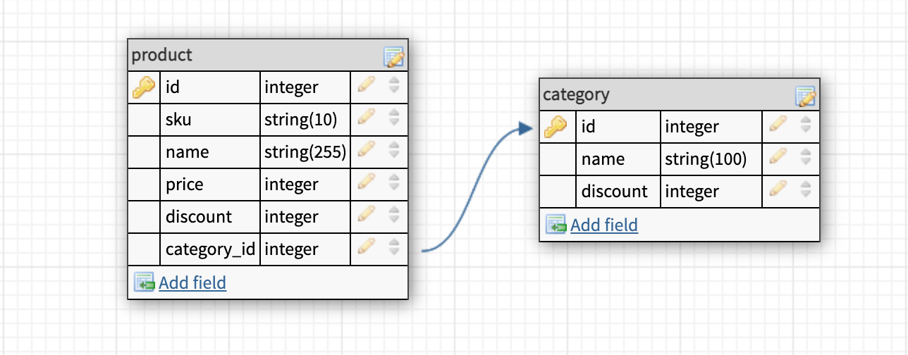

## The Product List Challenge

This is a product list challenge using symfony framework.

## Technologies:

-  Symfony 5.4.1
-  MySQL 8
-  PHP7.4
-  Docker
-  Nginx
-  Doctrine
## How to run:

- Make sure you have  internet connection to download dependencies.
- Make sure you have docker and docker-compose up and running in your computer; if not take a look at below links:
    - docker desktop [installation](https://www.docker.com/get-started)
    - docker [installation](https://docs.docker.com/engine/install/)
    - docker-compose [installation](https://docs.docker.com/compose/install/)
- Download the git repository
- Open your terminal in project directory
- Run `docker-compose up -d --build` command to run project in the background.
    - Application will run on port `8080` , make sure the port is free or is not blocked.
- Be patient it takes a minute to download the dependencies.
  - For monitoring the events run `docker-compose logs -f` at the root of the project, the installer will print `*************** Done ***************` when install completed.
  - For monitoring, you can also open `http://localhost:8080` it will show the message that installer is working you can keep refreshing the browser.
- Application is now running `http://localhost:8080` address

Note: if there was an error, or it takes too long to install, please remove the `mysql` folder which is located in `docker` folder and run the installation again.

## How to run the tests:

When the application runs successfully you can run tests by running `docker-compose exec  php74-service php vendor/bin/phpunit` at the root of the project.

## How to use it:

Use  `http://localhost:8080/product/list` to see list of product.

You can also pass following query parameters:

- category: filter the output with category name (optional)
- priceLessThan: filter the output with category name (optional)
- page: each page show 5 products. page starts from 0 (optional)

sample of query string mode: `http://localhost:8080/product/list?category=boots&priceLessThan=99000&page=0`

## How to add more product:

We can add more products in `install/products.json` file.

Note: if you run project once and wants more products just remove the `mysql` folder which is located in `docker` folder and run the project again.

TODO: we can add  updater file later on to skip rerunning the application for adding new product.

## How it Works and Why:

This Application Use symfony/skeleton as PHP framework.
I use Docker to automate the installation progress and make the development environment ready to go.
so docker-compose is the best choice for run multiple images and containers together in the same network.

For automating I use an installer.php file which is located in `install` folder, and a worker container that run this installer and die after that (see the docker-compose file).

The installer file save all the json data in the MySQL database that we need to retrieve later.

Database schema is the same as bellow image:

As in the real world every category and products can have separate discounts we put discount field in each table separately.

As the product can be growth to 20.000 whe prefer that the installer file convert json array to MySQL database that can be manage and retrieve faster.

Our Code is simple as its we have a single Controller that is responsible for managing request and put data togther.

We also have `OutPutFormatter` service that format the output json and this service use
`Discounter` service to calculate the discount.
These services separated to reduce complexity and increase maintainability.